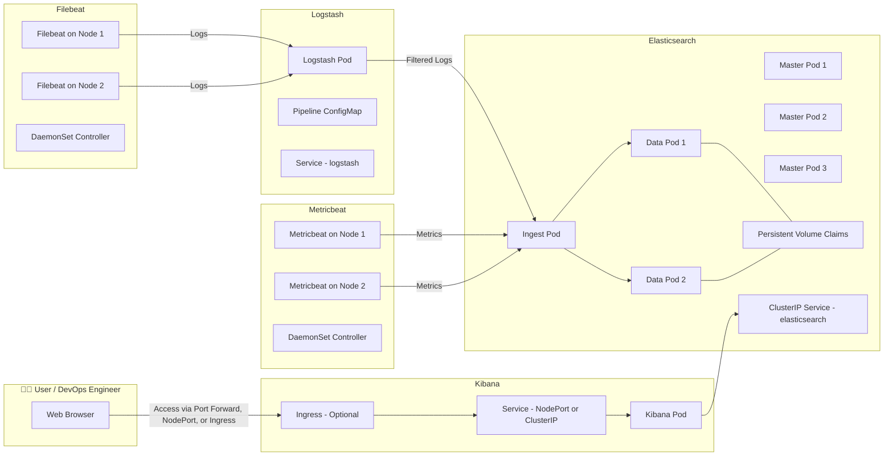

```mermaid
flowchart LR
    subgraph User["👩‍💻 User / DevOps Engineer"]
        Browser["Web Browser"]
    end

    subgraph KB["Kibana"]
        KB_Pod["Kibana Pod"]
        KB_SVC["Service - NodePort or ClusterIP"]
        KB_ING["Ingress - Optional"]
    end

    subgraph ES["Elasticsearch"]
        ES_Master1["Master Pod 1"]
        ES_Master2["Master Pod 2"]
        ES_Master3["Master Pod 3"]
        ES_Data1["Data Pod 1"]
        ES_Data2["Data Pod 2"]
        ES_Ingest["Ingest Pod"]
        PVC_ES["Persistent Volume Claims"]
        ES_SVC["ClusterIP Service - elasticsearch"]
    end

    subgraph LS["Logstash"]
        LS_Pod["Logstash Pod"]
        LS_CM["Pipeline ConfigMap"]
        LS_SVC["Service - logstash"]
    end

    subgraph FB["Filebeat"]
        FB_Node1["Filebeat on Node 1"]
        FB_Node2["Filebeat on Node 2"]
        FB_DS["DaemonSet Controller"]
    end

    subgraph MB["Metricbeat"]
        MB_Node1["Metricbeat on Node 1"]
        MB_Node2["Metricbeat on Node 2"]
        MB_DS["DaemonSet Controller"]
    end

    %% Flows
    Browser -->|Access via Port Forward, NodePort, or Ingress| KB_ING
    KB_ING --> KB_SVC
    KB_SVC --> KB_Pod
    KB_Pod --> ES_SVC

    FB_Node1 -->|Logs| LS_Pod
    FB_Node2 -->|Logs| LS_Pod
    LS_Pod -->|Filtered Logs| ES_Ingest

    MB_Node1 -->|Metrics| ES_Ingest
    MB_Node2 -->|Metrics| ES_Ingest

    ES_Ingest --> ES_Data1
    ES_Ingest --> ES_Data2
    ES_Data1 --- PVC_ES
    ES_Data2 --- PVC_ES

```